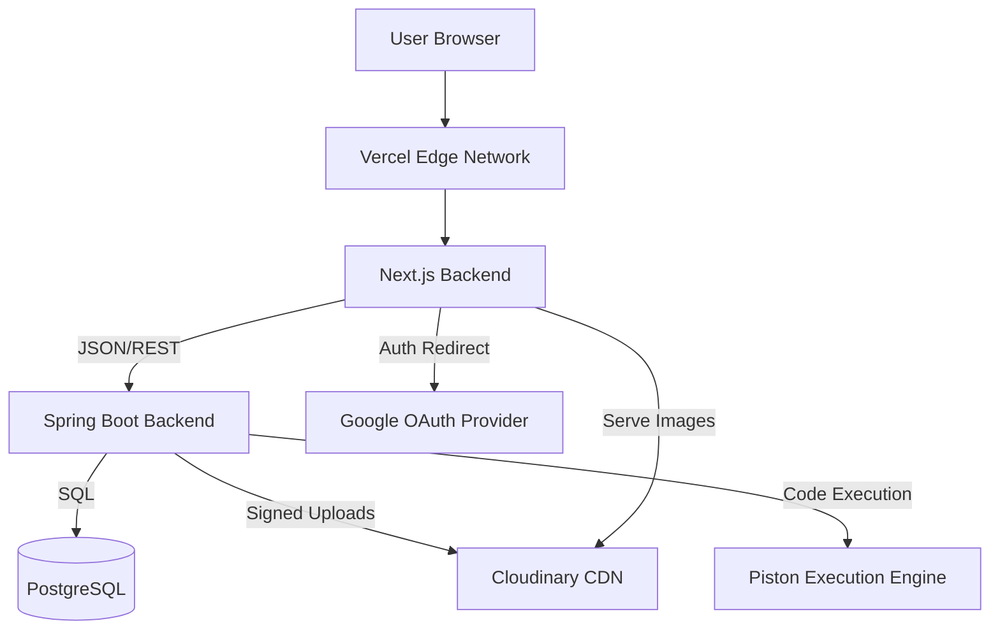

# 🧠 RuntimeRiver: Technical Deep Dive & Architecture Reference
> **Version**: 1.0.0
> **Target Audience**: Technical Interviewers, System Architects, Senior Engineers.

---

## 🏗️ 1. High-Level Architecture
RuntimeRiver is a **Cloud-Native Full-Stack Application** designed for scalability, performance, and developer productivity. It follows a decoupled **Client-Server Architecture**.

### **Tech Stack At A Glance**
| Layer | Technology | Key Libraries/Features |
| :--- | :--- | :--- |
| **Frontend** | **Next.js 14** (React 18) | App Router, Server Components, Tailwind CSS, Lucide Icons |
| **Backend** | **Spring Boot 3.2** | Java 17, Spring Security 6, JPA/Hibernate, Maven |
| **Database** | **PostgreSQL** | Relational Data Modeling, ACID Transactions |
| **Auth** | **JWT + OAuth2** | Stateless Authentication, Google Sign-In |
| **Storage** | **Cloudinary** | Image CDN, Optimization, Transformation |
| **Execution**| **Piston API** | Sandboxed Code Execution Engine (Docker-based) |
| **Hosting** | **Vercel** (FE) + **Railway** (BE) | CI/CD Integration, Edge Caching |

---

## 🛡️ 2. Backend Architecture (Spring Boot)

### **2.1 Security Layer (The 7-Layer Shield)**
We moved beyond basic auth to a robust, stateless security chain using **Spring Security 6**.
- **Filter Chain**: We intercepted requests *before* they hit Controllers.
    - `CorsFilter`: Configured for `runtimeriver.com` and `localhost`.
    - `JwtAuthenticationFilter`: Custom filter that:
        1. Extracts `Bearer` token from Header.
        2. Validates signature using `HmacSHA256`.
        3. Parses Claims (User ID, Email, Role).
        4. Injects `UsernamePasswordAuthenticationToken` into the `SecurityContext`.
- **Role-Based Access Control (RBAC)**:
    - `@EnableMethodSecurity`: Allows method-level protection.
    - **Granular Permissions**:
        - `ADMIN`: User management, System configs.
        - `EDITOR`: Manage all content, Media Library.
        - `REVIEWER`: Can edit drafts, cannot publish.
        - `USER`: Read-only + Comment/Like.

### **2.2 Data Modeling (JPA Entities)**
We used `Hibernate` for ORM but optimized for performance.
- **`Post` Entity**: Central content unit.
    - Relationships: `ManyToOne` (Author), `ManyToMany` (Categories), `OneToMany` (Comments).
    - **Optimization**: Lazy loading for Comments/Revisions to prevent N+1 problems on lists.
- **`Job` Entity**:
    - Uses `Enumerated(EnumType.STRING)` for `JobType`, `JobStatus`, ensuring typesafe DB values.
    - Custom indexes on `status` and `creationDate` for fast filtering.

---

## 🎨 3. Frontend Architecture (Next.js 14)

### **3.1 App Router & Server Components**
We leveraged the **Next.js 14 App Router** for hybrid rendering.
- **React Server Components (RSC)**: Used for Marketing pages, Blog lists, and Static content.
    - *Benefit*: Zero client-side JS bundle for these parts, ultra-fast First Contentful Paint (FCP).
- **Client Components (`"use client"`)**: Used for interactive islands:
    - `AuthContext`: Manages user session state using React Context API + LocalStorage persistence.
    - `RichTextEditor`: Interactive TipTap wrapper.
    - `CompilerClient`: Real-time code execution UI.

### **3.2 Modular Component Design**
We built a **Atomic Design System** using Tailwind CSS.
- **`ui/`**: Base primitives (Button, Input, Card). Highly reusable, unstyled logic.
- **`components/`**: Business logic components (LoginPopup, Sidebar).
- **`lib/api-client.js`**: Centralized Axios/Fetch wrapper.
    - **Interceptors**: Automatically attaches JWT token to every request.
    - **Error Handling**: Global 401/403 handler to redirect to Login.

---

## ⚡ 4. Deep Dive: Key Feature Implementations

### **4.1 💻 The Online Compiler (Logic Flow)**
*How do we run code securely in the browser?*

1.  **User Input**: User types code (e.g., Python) and Input (stdin) in `CompilerClient.jsx`.
2.  **Frontend Logic**:
    - We map languages to Piston API versions (e.g., Python -> `3.10.0`).
    - We bundle `code` + `stdin` into a JSON payload.
3.  **Execution (Piston)**:
    - The request hits `https://emkc.org/api/v2/piston`.
    - Piston spins up an ephemeral **Docker container**.
    - Writes code to `main.py` and pipes `stdin` to the process.
    - Captures `stdout` and `stderr`.
4.  **Result Rendering**:
    - We parse the JSON response.
    - If `run.code !== 0`, we render Red error text.
    - If `run.code === 0`, we render Green output.

### **4.2 🖼️ Media Library & Cloudinary (Logic Flow)**
*How did we solve the "edit post image" problem?*

1.  **Direct-to-Backend Upload**:
    - Browser sends `MultipartFile` to Spring Boot (`/api/media/upload`).
2.  **Server-Side Handling**:
    - `CloudinaryService.java` receives the stream.
    - **Crucial Step**: We set `use_filename=true` and `unique_filename=false` to preserve SEO-friendly filenames.
    - Uploads to Cloudinary Data Center.
3.  **Persistence**:
    - Cloudinary returns a secure URL (`https://res.cloudinary.com/...`).
    - We save metadata (`public_id`, `url`) to our `UploadedImage` table.
4.  **Frontend Integration**:
    - **RichTextEditor**: We intercepted the "Image" button. Instead of `window.prompt`, it triggers a React Modal (`MediaLibrary`).
    - User selects an image -> We execute `editor.chain().focus().setImage({ src: url }).run()`.

### **4.3 📝 The Rich Text Editor (TipTap)**
We chose **TipTap** (Headless ProseMirror) over Quill/TinyMCE for full control.
- **Extensions**: We registered `StarterKit`, `Image`, `Link`, `CodeBlockLowlight` (for syntax highlighting).
- **Custom Logic**:
    - **TOC Generation**: We traverse the JSON document tree, extract `heading` nodes, allow user to pick levels (H2/H3), and inject a standard HTML Table of Contents into the document flow.
- **Media Handler**: Custom prop `onRequestImage` allows us to decouple the editor from the Media Library UI.

---

## 🚀 5. Deployment Pipeline

### **Backend (Railway)**
- **Dockerfile**:
    - Stage 1 (Build): `maven:3.8.4-openjdk-17` runs `mvn clean package -DskipTests`.
    - Stage 2 (Run): `openjdk:17-slim` runs the JAR.
    - *Why?* Multi-stage build reduces image size from ~800MB to ~150MB.
- **Environment**: Injection of `JDBC_URL`, `JWT_SECRET` at runtime.

### **Frontend (Vercel)**
- **Build Command**: `next build`.
- **Edge Network**: Vercel automatically caches static assets (images, CSS) on their CDN.
- **Environment**: `NEXT_PUBLIC_API_URL` points to Railway instance.

---

## 🔮 6. Future Roadmap
- **WebSockets**: Real-time collaboration on the Compiler (Pair Programming).
- **Redis Caching**: Cache `GetAllPosts` to reduce DB load.
- **AI Integration**: "Explain this Code" button in the compiler using Gemini API.

---
*Document prepared for technical evaluation. (c) RuntimeRiver.*
